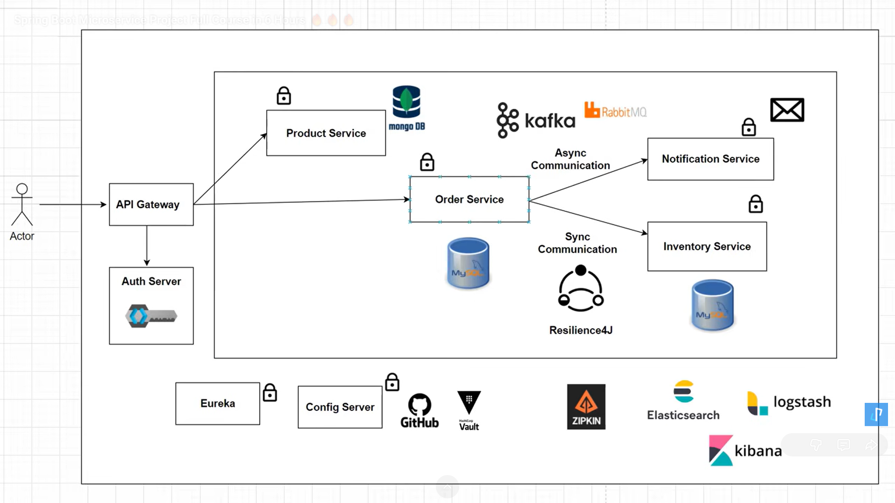

Microservices app for E-Commerce domain (https://www.youtube.com/watch?v=yn_stY3HCr8&list=PLSVW22jAG8pBnhAdq9S8BpLnZ0_jVBj0c&index=26)
---------------------------------------------------------------------------------------------------------------------------------

Modules - Services we are going to build
1. product-service - Create and view Product, act as product catalog
2. order-service - Can order product
3. inventory-service - can check if product is in stock or not
4. Notification service - Can send Notification, after order is placed

---  Keyclock ---

1. Start keycloak on personal port
kc.bat start-dev --http-port=8180

-----  Zipkin ----------
docker run -d -p 9411:9411 openzipkin/zipkin

----  Docker -------

First command to pull docker images - docker compose up -d
To check running containers - docker ps
To check logs of broker - docker logs -f broker

1. To create docker image of api gateway using Dockerfile
   docker build -t api-gateway-docker .

2. To create docker image of api gateway using Dockerfile.layered (To reduce size of docker image and to perform multistage build)
   docker build -t api-gateway-layered-docker -f Dockerfile.layered

3. jib-maven-plugin
   Use it to create docker images without using docker file

4. 

------  Remaining ------

Notification service consumer throwing error regarding deserialization

